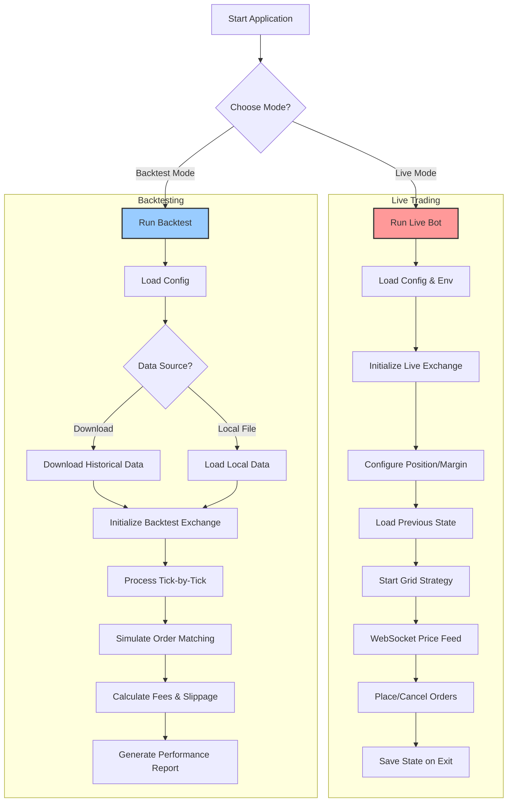

# Binance Futures Grid Trading Bot

[](https://golang.org/dl/)
[](https://opensource.org/licenses/MIT)
[](https://goreportcard.com/report/github.com/yudaprama/grid-trading-bot)

A high-frequency grid trading bot for Binance Futures, written in Go. It supports both live trading and historical data backtesting to help you develop and verify your trading strategies.

## 🚀 Features

- **🔴 Live Trading Mode**: Connects to Binance API to trade in real-time
- **📊 Backtesting Mode**: Test your strategy on historical K-line data
- **📥 Automatic Data Downloader**: Downloads historical data for backtesting automatically
- **💾 State Persistence**: Saves bot state (grid orders) for graceful restarts
- **⚙️ Highly Configurable**: Comprehensive configuration via JSON and environment variables
- **📝 Structured Logging**: Uses `zap` for structured, leveled logging with file rotation
- **📈 Detailed Reporting**: Generates comprehensive performance reports after backtests
- **🔒 Testnet Support**: Full support for Binance testnet for safe testing
- **🛡️ Risk Management**: Built-in liquidation prevention and wallet exposure limits
- **📈 Trailing Stops**: Advanced trailing stop functionality for automated profit-taking and loss-limiting

## 📋 Table of Contents

- [Prerequisites](#prerequisites)
- [Installation](#installation)
  - [Download Pre-built Binaries](#download-pre-built-binaries)
  - [Build from Source](#build-from-source)
- [Configuration](#configuration)
  - [Environment Variables](#environment-variables)
  - [Configuration File](#configuration-file)
  - [Trailing Stops Configuration](#trailing-stops-configuration)
- [Usage](#usage)
  - [Live Trading](#live-trading)
  - [Backtesting](#backtesting)
- [Trailing Stops](#trailing-stops)
- [Architecture](#architecture)
- [API Setup](#api-setup)
- [Troubleshooting](#troubleshooting)
- [Development](#development)
- [Safety and Disclaimer](#safety-and-disclaimer)
- [License](#license)

## Prerequisites

- **Binance Account**: Required for live trading
- **API Keys**: Binance API keys with Futures trading permissions

## Installation

### Download Pre-built Binaries

The easiest way to get started is to download pre-built binaries from the [GitHub Releases](https://github.com/yudaprama/grid-trading-bot/releases) page.

1. **Go to the releases page:**
   Visit [https://github.com/yudaprama/grid-trading-bot/releases](https://github.com/yudaprama/grid-trading-bot/releases)

2. **Download the appropriate binary for your platform:**
   - **macOS (Intel)**: `grid-bot-darwin-amd64`
   - **macOS (Apple Silicon)**: `grid-bot-darwin-arm64`
   - **Linux**: `grid-bot-linux-amd64`
   - **Windows**: `grid-bot-windows-amd64.exe`

3. **Make it executable (macOS/Linux):**
   ```bash
   chmod +x grid-bot-darwin-amd64  # or your downloaded binary
   ```

4. **Run the bot:**
   ```bash
   ./grid-bot-darwin-amd64 --help  # or your downloaded binary
   ```

### Build from Source

If you prefer to build from source or need to modify the code:

1. **Clone the repository:**
   ```bash
   git clone https://github.com/yudaprama/grid-trading-bot.git
   cd grid-trading-bot
   ```

2. **Install dependencies:**
   ```bash
   go mod tidy
   ```

3. **Build the executable:**
   ```bash
   go build -o grid-bot ./cmd/bot/main.go
   ```

4. **Make it executable (optional):**
   ```bash
   chmod +x grid-bot
   ```

## Configuration

### Environment Variables

Create a `.env` file in the project root or set these environment variables:

```bash
# Required for live trading
BINANCE_API_KEY=your_api_key_here
BINANCE_SECRET_KEY=your_secret_key_here
```

**⚠️ Important**: Never commit your API keys to version control. Add `.env` to your `.gitignore` file.

### Configuration File

The bot uses a `config.json` file for configuration. Here's the complete structure with explanations:

| Parameter | Type | Description | Default |
|-----------|------|-------------|---------|
| `is_testnet` | boolean | Use Binance testnet (true) or live trading (false) | `true` |
| `live_api_url` | string | Binance Futures API URL | `"https://fapi.binance.com"` |
| `live_ws_url` | string | Binance Futures WebSocket URL | `"wss://fstream.binance.com"` |
| `testnet_api_url` | string | Binance testnet API URL | `"https://testnet.binancefuture.com"` |
| `testnet_ws_url` | string | Binance testnet WebSocket URL | `"wss://stream.binancefuture.com"` |
| `symbol` | string | Trading pair symbol | `"BNBUSDT"` |
| `grid_spacing` | float64 | Grid spacing as percentage (0.007 = 0.7%) | `0.007` |
| `grid_quantity` | float64 | Quantity for each grid order | `0.02` |
| `min_notional_value` | float64 | Minimum notional value for orders | `5.0` |
| `initial_investment` | float64 | Initial investment amount | `1600.0` |
| `leverage` | integer | Trading leverage | `10` |
| `margin_type` | string | Margin type: "CROSSED" or "ISOLATED" | `"CROSSED"` |
| `hedge_mode` | boolean | Enable hedge mode | `false` |
| `grid_count` | integer | Maximum number of grid levels | `100` |
| `active_orders_count` | integer | Maximum active orders at once | `3` |
| `return_rate` | float64 | Return rate to trigger grid reset | `0.15` |
| `wallet_exposure_limit` | float64 | Maximum wallet exposure multiplier | `3.0` |
| `retry_attempts` | integer | Number of retry attempts for failed operations | `5` |
| `retry_initial_delay_ms` | integer | Initial retry delay in milliseconds | `1000` |
| `taker_fee_rate` | float64 | Taker fee rate for backtesting | `0.0004` |
| `maker_fee_rate` | float64 | Maker fee rate for backtesting | `0.0002` |
| `slippage_rate` | float64 | Slippage rate for backtesting | `0.0005` |
| `maintenance_margin_rate` | float64 | Maintenance margin rate | `0.005` |
| `enable_trailing_up` | boolean | Enable trailing take profit functionality | `false` |
| `enable_trailing_down` | boolean | Enable trailing stop loss functionality | `false` |
| `trailing_up_distance` | float64 | Distance for trailing up adjustments | `0.02` |
| `trailing_down_distance` | float64 | Distance for trailing down adjustments | `0.015` |
| `trailing_type` | string | Distance type: "percentage" or "absolute" | `"percentage"` |

#### Logging Configuration

The `log` section in `config.json` configures logging behavior:

```json
{
  "log": {
    "level": "info",
    "output": "both",
    "file": "logs/grid-bot.log",
    "max_size": 10,
    "max_backups": 5,
    "max_age": 30,
    "compress": false
  }
}
```

| Parameter | Description |
|-----------|-------------|
| `level` | Log level: "debug", "info", "warn", "error" |
| `output` | Output destination: "console", "file", or "both" |
| `file` | Log file path |
| `max_size` | Maximum size in MB before rotation |
| `max_backups` | Number of backup files to keep |
| `max_age` | Maximum age in days before deletion |
| `compress` | Compress rotated files |

### Trailing Stops Configuration

The bot supports advanced trailing stop functionality to automatically manage profit-taking and loss-limiting:

```json
{
  "enable_trailing_up": true,
  "enable_trailing_down": true,
  "trailing_up_distance": 0.025,
  "trailing_down_distance": 0.02,
  "trailing_type": "percentage"
}
```

| Parameter | Description | Example |
|-----------|-------------|---------|
| `enable_trailing_up` | Enable trailing take profit | `true` |
| `enable_trailing_down` | Enable trailing stop loss | `true` |
| `trailing_up_distance` | Distance for trailing up (2.5% = 0.025) | `0.025` |
| `trailing_down_distance` | Distance for trailing down (2% = 0.02) | `0.02` |
| `trailing_type` | Distance calculation method | `"percentage"` or `"absolute"` |

**Trailing Types:**
- **`"percentage"`**: Distance as percentage (e.g., 0.02 = 2%)
- **`"absolute"`**: Distance as absolute price units (e.g., 2.0 = $2)

## Usage

### Live Trading

**⚠️ Always test on testnet first!**

1. **Set up environment variables:**
   ```bash
   export BINANCE_API_KEY="your_api_key"
   export BINANCE_SECRET_KEY="your_secret_key"
   ```

2. **Configure for testnet (recommended for testing):**
   ```json
   {
     "is_testnet": true,
     ...
   }
   ```

3. **Run the bot:**
   ```bash
   ./grid-bot --mode live --config config.json
   ```

4. **Production trading** (after thorough testing):
   ```json
   {
     "is_testnet": false,
     ...
   }
   ```

The bot will:
- Load your configuration and validate API credentials
- Set position mode and margin type as configured
- Start the grid trading strategy
- Save state to `grid_state.json` for graceful restarts
- Handle interruption signals (Ctrl+C) gracefully

### Backtesting

#### Option 1: Auto-Download Historical Data

Download data automatically and run backtest:

```bash
# Download and backtest BNB/USDT from Jan 1 to Feb 1, 2024
./grid-bot --mode backtest --symbol BNBUSDT --start 2024-01-01 --end 2024-02-01

# Download and backtest BTC/USDT for a specific period
./grid-bot --mode backtest --symbol BTCUSDT --start 2024-06-01 --end 2024-07-01
```

Data will be saved as `data/SYMBOL-START-END.csv` for future use.

#### Option 2: Use Existing Data

If you already have historical data:

```bash
# Use pre-downloaded data file
./grid-bot --mode backtest --data data/BNBUSDT-2024-01-01-2024-02-01.csv

# The symbol will be automatically extracted from the filename
```

#### Backtest Output

After completion, you'll get a detailed report including:
- 📊 Total trades and win rate
- 💰 Profit/loss analysis
- 📈 Return on investment (ROI)
- ⏰ Trading period statistics
- 📋 Detailed trade history

## Trailing Stops

The bot includes advanced trailing stop functionality to automatically manage profit-taking and loss-limiting. This feature helps lock in profits while allowing for continued favorable price movement.

### Overview

Trailing stops automatically adjust stop loss and take profit levels as the market price moves favorably:

1. **Trailing Up (Trailing Take Profit)**: Adjusts take profit levels upward as price moves favorably
2. **Trailing Down (Trailing Stop Loss)**: Adjusts stop loss levels to follow price movements and limit losses

### How It Works

#### Trailing Up (Take Profit)

For LONG positions:
- Monitors the highest price reached since position entry
- When price moves up, adjusts the take profit level to stay below the highest price
- Only moves the take profit level higher (never lower)
- Helps lock in profits while allowing for continued upward movement

**Example with 2% trailing up distance:**
- Entry price: $100
- Price rises to $110 → Take profit set at $107.80 (110 × 0.98)
- Price rises to $115 → Take profit adjusted to $112.70 (115 × 0.98)
- If price falls back to $112, the take profit at $112.70 would be triggered

#### Trailing Down (Stop Loss)

For LONG positions:
- Monitors price movements to limit losses
- Adjusts stop loss level to follow the lowest price reached
- Helps limit losses while allowing for potential recovery

**Example with 1.5% trailing down distance:**
- Entry price: $100
- Price falls to $95 → Stop loss set at $93.58 (95 × 0.985)
- Price falls to $90 → Stop loss adjusted to $88.65 (90 × 0.985)

### Configuration Examples

#### Conservative Setup (Recommended for beginners)
```json
{
  "enable_trailing_up": true,
  "enable_trailing_down": true,
  "trailing_up_distance": 0.03,
  "trailing_down_distance": 0.025,
  "trailing_type": "percentage"
}
```

#### Aggressive Setup (For experienced traders)
```json
{
  "enable_trailing_up": true,
  "enable_trailing_down": true,
  "trailing_up_distance": 0.015,
  "trailing_down_distance": 0.01,
  "trailing_type": "percentage"
}
```

#### Absolute Distance Setup
```json
{
  "enable_trailing_up": true,
  "enable_trailing_down": true,
  "trailing_up_distance": 2.5,
  "trailing_down_distance": 1.5,
  "trailing_type": "absolute"
}
```

### Integration with Grid Trading

The trailing stop functionality integrates seamlessly with the grid trading strategy:

1. **Initialization**: Trailing stops are initialized when the base position is established
2. **Price Monitoring**: The bot monitors price changes every 10 seconds
3. **Order Management**: Trailing stop orders are placed and updated automatically
4. **Cycle Management**: Trailing stops are reset when a trading cycle completes
5. **Conflict Resolution**: Trailing stop orders are handled separately from grid orders

### Monitoring and Logging

The bot provides comprehensive logging for trailing stop activities:

```
=== Trailing Stop Status ===
Position: LONG, Entry Price: 100.0000, Current Price: 105.2000
Highest Price: 108.5000, Lowest Price: 98.2000
Unrealized P&L: 5.20%
Trailing Up Level: 106.3300 (Order ID: 12345, Distance: 2.00%)
Trailing Down Level: 96.5470 (Order ID: 12346, Distance: 1.50%)
Total Adjustments: 3, Last Update: 14:32:15
Recent adjustments (last hour): 2
```

### History Tracking

All trailing stop adjustments are automatically saved to JSON files for analysis:
- Files are named `trailing_stop_history_YYYY-MM-DD.json`
- Include complete state and adjustment history
- Useful for strategy optimization and performance analysis

### Best Practices

1. **Start Conservative**: Begin with wider trailing distances (2-3%)
2. **Test Thoroughly**: Always test on testnet before live trading
3. **Monitor Performance**: Review trailing stop history files regularly
4. **Market Conditions**: Consider disabling in highly volatile markets
5. **Risk Management**: Trailing stops complement but don't replace proper position sizing

### Limitations

- Trailing stops work best in trending markets
- May result in premature exits in choppy/sideways markets
- Requires stable internet connection for real-time monitoring
- Exchange rate limits may affect order update frequency

## Architecture

The bot follows a modular architecture with clear separation between live trading and backtesting:



### Key Components

- **Exchange Layer**: Abstracts live trading and backtesting
- **Bot Logic**: Core grid trading strategy implementation  
- **State Management**: Persistent state for graceful restarts
- **Reporter**: Comprehensive performance analysis
- **Logger**: Structured logging with rotation
- **Downloader**: Historical data acquisition

## API Setup

### Getting Binance API Keys

1. **Create Binance Account**: Sign up at [binance.com](https://binance.com)
2. **Enable 2FA**: Set up two-factor authentication
3. **Create API Key**:
   - Go to Account > API Management
   - Create new API key
   - **Important**: Enable "Enable Futures" permission
   - Restrict IP access for security
   - **Never enable withdrawal permissions**

### Testnet Setup

For safe testing, use Binance Testnet:

1. Visit [testnet.binancefuture.com](https://testnet.binancefuture.com)
2. Create testnet API keys
3. Set `is_testnet: true` in your config
4. Use testnet keys in your environment variables

## Troubleshooting

### Common Issues

**❌ "BINANCE_API_KEY and BINANCE_SECRET_KEY must be set"**
- Solution: Set environment variables or create `.env` file

**❌ "Failed to initialize exchange"**
- Check API key permissions (Futures must be enabled)
- Verify network connectivity
- Ensure correct testnet/live URL configuration

**❌ "Insufficient margin"** 
- Reduce `initial_investment` or `leverage`
- Check wallet balance
- Verify `wallet_exposure_limit` setting

**❌ "Symbol not found"**
- Ensure the symbol exists on Binance Futures
- Check symbol format (e.g., "BTCUSDT", not "BTC/USDT")

**❌ Data download fails**
- Check internet connectivity
- Verify date format (YYYY-MM-DD)
- Ensure date range is valid

**❌ Trailing stops not working**
- Ensure `enable_trailing_up` or `enable_trailing_down` is set to `true`
- Check that trailing distances are reasonable (0.01-0.05 for percentage)
- Verify stable internet connection for price monitoring
- Review logs for trailing stop adjustment messages

### Debug Mode

Enable debug logging for troubleshooting:

```json
{
  "log": {
    "level": "debug",
    "output": "both"
  }
}
```

### Getting Help

- Check logs in the configured log file
- Review bot state in `grid_state.json`
- Ensure configuration matches your trading requirements
- Test on testnet before live trading

## Development

### Project Structure

```
binance-grid-bot-go/
├── cmd/bot/              # Application entry point
├── internal/
│   ├── bot/             # Core trading logic
│   ├── config/          # Configuration management
│   ├── downloader/      # Historical data downloader
│   ├── exchange/        # Exchange interfaces
│   ├── logger/          # Logging utilities
│   ├── models/          # Data models
│   └── reporter/        # Performance reporting
├── config.json                    # Configuration file
├── config_with_trailing_stops_example.json  # Example config with trailing stops
├── grid_state.json                # Bot state (auto-generated)
├── trailing_stop_history_*.json   # Trailing stop history (auto-generated)
└── logs/                          # Log files
```

### Contributing

1. Fork the repository
2. Create a feature branch: `git checkout -b feature-name`
3. Make your changes and add tests
4. Run tests: `go test ./...`
5. Commit: `git commit -am 'Add feature'`
6. Push: `git push origin feature-name`
7. Create a Pull Request

### Building for Different Platforms

```bash
# Linux
GOOS=linux GOARCH=amd64 go build -o grid-bot-linux ./cmd/bot/main.go

# Windows
GOOS=windows GOARCH=amd64 go build -o grid-bot-windows.exe ./cmd/bot/main.go

# macOS
GOOS=darwin GOARCH=amd64 go build -o grid-bot-macos ./cmd/bot/main.go
```

## Safety and Disclaimer

### ⚠️ Important Safety Guidelines

1. **Always test on testnet first** before live trading
2. **Start with small amounts** to validate your strategy
3. **Monitor your positions** regularly
4. **Set appropriate risk limits** in configuration
5. **Never commit API keys** to version control
6. **Keep your API keys secure** and rotate them regularly
7. **Understand the risks** of automated trading
8. **Test trailing stops thoroughly** before using in live trading
9. **Use conservative trailing distances** when starting out

### Risk Warning

**Cryptocurrency trading involves substantial risk and is not suitable for all investors.** Past performance does not guarantee future results. The use of trading bots can amplify both profits and losses. You could lose some or all of your investment.

**Key Risks:**
- Market volatility can cause rapid losses
- Grid trading can accumulate positions in trending markets
- Technical failures may disrupt trading
- API rate limits or downtime can affect performance
- Configuration errors can lead to unintended behavior

### Disclaimer

This software is provided "as is" without warranty of any kind. The authors and contributors are not responsible for any financial losses, damages, or consequences resulting from the use of this software. Users are solely responsible for their trading decisions and risk management.

**Use at your own risk.**

## License

This project is licensed under the MIT License - see the [LICENSE](LICENSE) file for details.

---

**🌟 Happy Trading!** Remember to always prioritize risk management and never invest more than you can afford to lose.
